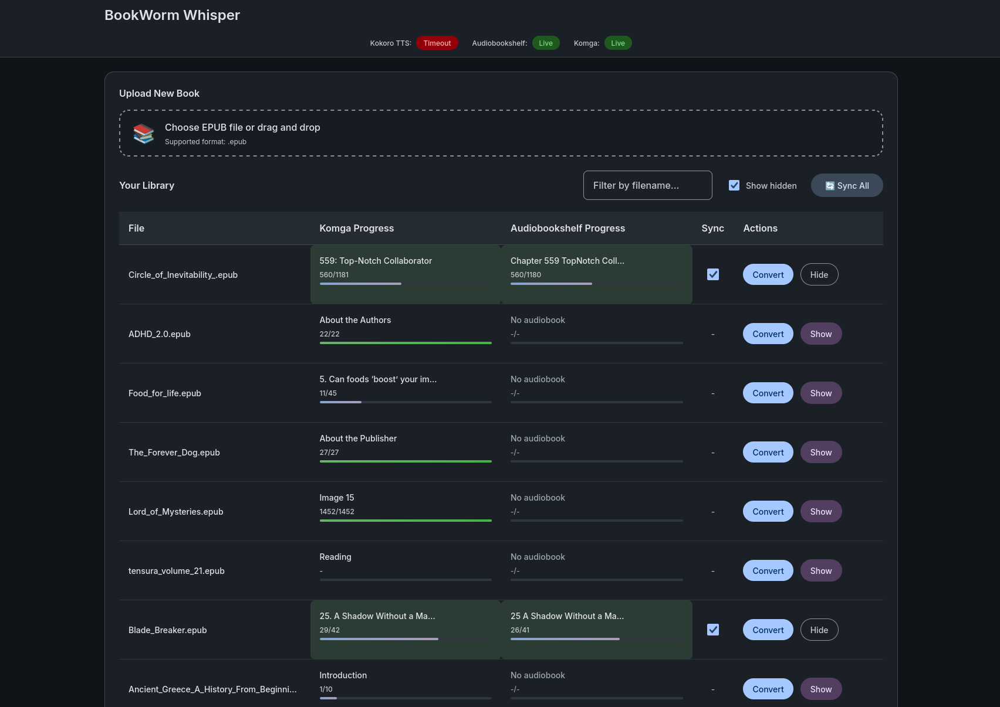

# BookWorm Whisper

A web interface for converting EPUB books to audiobooks with reading progress synchronization between Komga and Audiobookshelf.



It was inspired after the need of using a Kobo e-reader([Komga](https://komga.org/docs/guides/kobo/)) and having its progress synced to audiobooks([Audiobookshelf](https://www.audiobookshelf.org/)) so to be able to listen that great book after leaving the confort of your favourite reading location.

This project bundles [epub_to_audiobook](https://github.com/p0n1/epub_to_audiobook) and [Kokoro-TTS](https://huggingface.co/spaces/hexgrad/Kokoro-TTS) for handling EPUB to audiobook conversion.

## Disclaimer

> **This application was developed with AI assistance and may contain bugs.** While efforts have been made to ensure quality and reliability, please use at your own risk. Always keep backups of your files. If you encounter issues, please report them on the issue tracker.

## Important: EPUB File Naming

**EPUB files must follow a specific naming convention for book matching to work correctly:**

```
name_of_the_book.epub
```

**Rules:**

- Use underscores (`_`) or hyphens (`-`) to separate words
- Do **NOT** include author names, dates, or other metadata in the filename
- The filename should match the book title as closely as possible

**Examples:**

| Correct                      | Incorrect                                      |
| ---------------------------- | ---------------------------------------------- |
| `The_Lord_of_the_Rings.epub` | `The_Lord_of_the_Rings_-_JRR_Tolkien.epub`     |
| `Pride_and_Prejudice.epub`   | `Pride and Prejudice (Jane Austen, 1813).epub` |
| `1984.epub`                  | `George_Orwell_-_1984_[epub].epub`             |

The book matching system normalizes filenames to pair EPUBs with audiobooks. Extra metadata in filenames will cause matching failures.

## Quick Start (Docker)

```bash
# Clone the repository
git clone https://github.com/your-username/bookworm-whisper.git
cd bookworm-whisper

# Clone the epub_to_audiobook converter
git clone https://github.com/p0n1/epub_to_audiobook.git

# Create environment file (optional, for API keys)
cp .env.example .env
# Edit .env with your API keys

# Build and run
docker build -t bookworm-whisper .
docker compose up -d
```

Access the web interface at `http://localhost:5001`

## Docker Compose Services

| Service          | Port  | Description                 |
| ---------------- | ----- | --------------------------- |
| bookworm-whisper | 5001  | Main web interface          |
| kokoro           | 8880  | Kokoro TTS API              |
| komga            | 25600 | Ebook reader (optional)     |
| audiobookshelf   | 13378 | Audiobook player (optional) |

## Environment Variables

| Variable                 | Default                    | Description                                        |
| ------------------------ | -------------------------- | -------------------------------------------------- |
| `OPENAI_BASE_URL`        | `http://localhost:8880/v1` | Kokoro TTS API endpoint                            |
| `OPENAI_API_KEY`         | -                          | API key (set to any value for Kokoro)              |
| `KOMGA_URL`              | -                          | Komga server URL                                   |
| `KOMGA_API_KEY`          | -                          | Komga API key                                      |
| `AUDIOBOOKSHELF_URL`     | -                          | Audiobookshelf server URL                          |
| `AUDIOBOOKSHELF_API_KEY` | -                          | Audiobookshelf API key                             |
| `GLOBAL_SYNC_TIME`       | `300`                      | Background sync interval in seconds (0 to disable) |

## Usage

### Converting Books

1. Place EPUB files in the `books/` directory or upload via the web UI
2. Click on a book to open the conversion form
3. Select voice model and chapter range
4. Click **Convert** to start the audiobook generation
5. Output files are saved to `output/{book_name}/`

### Voice Models

See [Kokoro TTS examples](https://huggingface.co/spaces/hexgrad/Kokoro-TTS) for voice samples.

## Reading Progress Sync

BookWorm Whisper synchronizes reading progress between **Komga** (ebook reader) and **Audiobookshelf** (audiobook player), allowing you to switch between reading and listening while keeping your place.

### How It Works

1. Books are paired between services by matching normalized titles
2. Progress is compared by extracting chapter numbers from chapter names
3. The service that's "behind" is updated to match the one that's "ahead"
4. Sync only occurs for books with the sync checkbox enabled

### Sync Triggers

- **Manual**: Click "Sync All" in the web UI
- **Background**: Automatic sync every `GLOBAL_SYNC_TIME` seconds
- **Page Load**: Progress data refreshes when viewing the library

### Enabling Sync for a Book

1. Book must exist in both Komga and Audiobookshelf
2. The "Sync" column shows a checkbox when both are detected
3. Check the box to enable bi-directional sync for that book

For detailed sync documentation, see [docs/SYNC.md](docs/SYNC.md).

## Troubleshooting

### Conversion not starting

- Check that Kokoro TTS is running and healthy
- Verify the EPUB file is valid
- Check the browser console and server logs for errors

### Books not syncing

- Ensure the book exists in both Komga and Audiobookshelf
- Check that the sync checkbox is enabled
- Verify API keys are configured correctly
- **Check your file naming** - files must be named `book_name.epub` without author or other metadata
- See [docs/SYNC.md](docs/SYNC.md) for detailed troubleshooting

### "Incompatible" or "Not Divina compatible" error

Some EPUBs are not compatible with Komga's progress tracking (Readium/Divina format). These books will show "Incompatible" in the UI and cannot be synced.

**Try the TOC fix tool first:**

```bash
python tools/fix_epub_toc.py books/your_book.epub
```

This rebuilds the Table of Contents which may fix compatibility. If that doesn't work, try re-converting the EPUB with Calibre or use a different source. See [docs/SYNC.md](docs/SYNC.md#known-limitations) for details.

### Books not matching between services

- Ensure EPUB filename follows the `book_name.epub` format
- Remove author names, dates, and extra metadata from filenames
- Check that Audiobookshelf audiobook folder name matches the normalized book title

## Thanks

Thanks to the following projects that make BookWorm Whisper possible:

- [epub_to_audiobook](https://github.com/p0n1/epub_to_audiobook) - EPUB to audiobook conversion
- [Kokoro-TTS](https://huggingface.co/spaces/hexgrad/Kokoro-TTS) - Text-to-speech engine
- [Komga](https://komga.org/) - Comic/ebook server
- [Audiobookshelf](https://www.audiobookshelf.org/) - Self-hosted audiobook server
